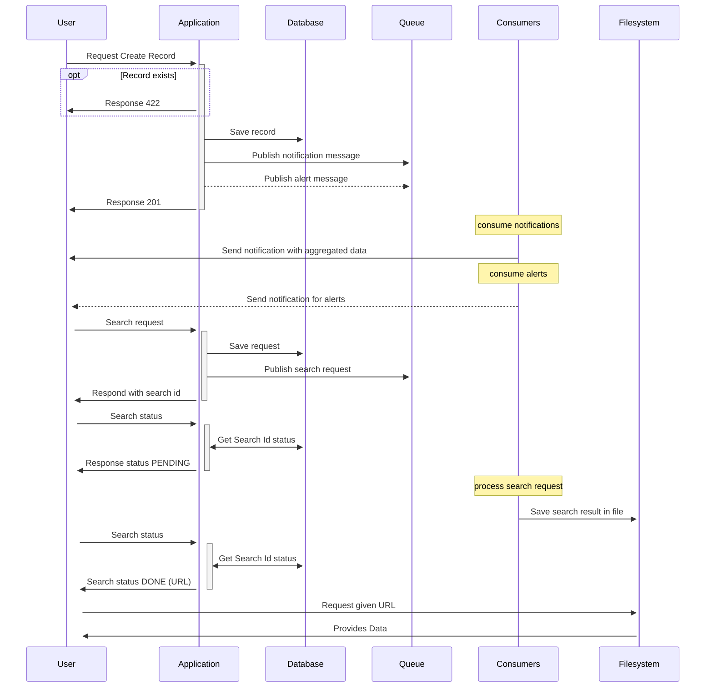

```mermaid
sequenceDiagram
    User->>+Application: Request Create Record
    activate Application;
    opt Record exists
        Application->>User: Response 422 
    end    
    Application->>+Database: Save record
    Application->>+Queue: Publish notification message
    Application-->>+Queue: Publish alert message
    Application->>+User: Response 201
    deactivate Application
    note over Consumers: consume notifications
    Consumers->>+User: Send notification with aggregated data
    note over Consumers: consume alerts
    Consumers-->>+User: Send notification for alerts
    User->>+Application: Search request
    activate Application
    Application->>+Database: Save request
    Application->>+Queue: Publish search request
    Application->>+User: Respond with search id
    deactivate Application
    User->>+Application: Search status
    activate Application
    Application<<->>+Database: Get Search Id status
    Application->>+User: Response status PENDING
    deactivate Application
    Note over Consumers: process search request
    Consumers->>+Filesystem: Save search result in file
    User->>+Application: Search status
    activate Application
    Application<<->>+Database: Get Search Id status
    Application->>+User: Search status DONE (URL)
    deactivate Application
    User->>+Filesystem: Request given URL
    Filesystem->>+User: Provides Data
```